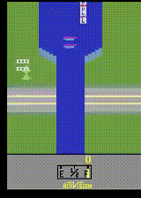

# Darwin Atari Project

GUI tool to train Gynasium atari games

**Select an atari game to train, change some hyperparameters, and watch the model train!**

## Features

Selection of [Hyperparameters](https://towardsdatascience.com/artificial-intelligence-hyperparameters-48fa29daa516) lke learning rate, batch size, device to train on, etc

Caches Neural Network, records videos, and logs the performance of the model over time

## Video Demo

https://github.com/ghubnerr/darwin/assets/80722367/c7b37eb9-6310-4042-992e-8b956894dd82

https://github.com/ghubnerr/darwin/assets/80722367/1f5f81c0-4e7c-4ab3-baf6-094ad62f8d2f

## Table of Contents

- [Darwin Atari Project](#darwin-atari-project)
  - [Features](#features)
  - [Video Demo](#video-demo)
  - [Table of Contents](#table-of-contents)
  - [Examples](#examples)
    - [Breakout](#breakout)
      - [Short Description](#short-description)
      - [Outputs](#outputs)
    - [Riverraid](#riverraid)
      - [Short Description](#short-description-1)
      - [Outputs](#outputs-1)
  - [Training Process](#training-process)
  - [Requirements](#requirements)
  - [Getting started](#getting-started)

## Examples

### [Breakout](https://gymnasium.farama.org/environments/atari/breakout/)

#### Short Description

You move a paddle and hit the ball in a brick wall at the top of the screen. Your goal is to destroy the brick wall. You can try to break through the wall and let the ball wreak havoc on the other side, all on its own! You have five lives.

Action Space: One of 4 Discrete actions

Observation Space: 210 x 160 x 3 array

#### Outputs

| Epoch | Video                               | Model                                                  |
| ----- | ----------------------------------- | ------------------------------------------------------ |
| 2045  |  | [Breakout 2045.pth](./assets/breakout/models/2045.pth) |
| 2000  |  | [2000.pth](./assets/breakout/models/2000.pth)          |
| 1900  |  | [1900.pth](./assets/breakout/models/1900.pth)          |
| 1800  |  | [1800.pth](./assets/breakout/models/1800.pth)          |
| 1700  |  | [1700.pth](./assets/breakout/models/1700.pth)          |
| 1600  |  | [1600.pth](./assets/breakout/models/1600.pth)          |
| 1500  |  | [1500.pth](./assets/breakout/models/1500.pth)          |
| 1400  |  | [1400.pth](./assets/breakout/models/1400.pth)          |
| 1300  |  | [1300.pth](./assets/breakout/models/1300.pth)          |
| 1200  |  | [1200.pth](./assets/breakout/models/1200.pth)          |
| 1100  |  | [1100.pth](./assets/breakout/models/1100.pth)          |
| 1000  |  | [1000.pth](./assets/breakout/models/1000.pth)          |
| 900   |   | [900.pth](./assets/breakout/models/900.pth)            |
| 800   |   | [800.pth](./assets/breakout/models/800.pth)            |
| 700   |   | [700.pth](./assets/breakout/models/700.pth)            |
| 600   |   | [600.pth](./assets/breakout/models/600.pth)            |
| 500   |   | [500.pth](./assets/breakout/models/500.pth)            |
| 400   |   | [400.pth](./assets/breakout/models/400.pth)            |
| 300   |   | [300.pth](./assets/breakout/models/300.pth)            |
| 200   |   | [200.pth](./assets/breakout/models/200.pth)            |
| 100   |   | [100.pth](./assets/breakout/models/100.pth)            |
| 0     |     | [0.pth](./assets/breakout/models/0.pth)                |

### [Riverraid](https://gymnasium.farama.org/environments/atari/riverraid/)

#### Short Description

You control a jet that flies over a river: you can move it sideways and fire missiles to destroy enemy objects. Each time an enemy object is destroyed you score points (i.e. rewards).You lose a jet when you run out of fuel: fly over a fuel depot when you begin to run low.You lose a jet even when it collides with the river bank or one of the enemy objects (except fuel depots).The game begins with a squadron of three jets in reserve and you’re given an additional jet (up to 9) for each 10,000 points you score.

Action Space: 17

- One action for doing nothing
- 8 Actions for moving -> L, R, U, D, UL, UR, DL, DR
- 8 Actions for firing -> L, R, U, D, UL, UR, DL, DR

Observation Space: 210 x 160 x 3 array

#### Outputs

| Epoch | Video                                | Model                                          |
| ----- | ------------------------------------ | ---------------------------------------------- |
| 1431  |  | [1431.pth](./assets/riverraid/models/1431.pth) |
| 1400  |  | [1400.pth](./assets/riverraid/models/1400.pth) |
| 1300  |  | [1300.pth](./assets/riverraid/models/1300.pth) |
| 1200  |  | [1200.pth](./assets/riverraid/models/1200.pth) |
| 1100  |  | [1100.pth](./assets/riverraid/models/1100.pth) |
| 1000  |  | [1000.pth](./assets/riverraid/models/1000.pth) |
| 900   |   | [900.pth](./assets/riverraid/models/900.pth)   |
| 800   |   | [800.pth](./assets/riverraid/models/800.pth)   |
| 700   |   | [700.pth](./assets/riverraid/models/700.pth)   |
| 600   |   | [600.pth](./assets/riverraid/models/600.pth)   |
| 500   |   | [500.pth](./assets/riverraid/models/500.pth)   |
| 400   |   | [400.pth](./assets/riverraid/models/400.pth)   |
| 300   |   | [300.pth](./assets/riverraid/models/300.pth)   |
| 200   |   | [200.pth](./assets/riverraid/models/200.pth)   |
| 100   |   | [100.pth](./assets/riverraid/models/100.pth)   |
| 0     |     | [0.pth](./assets/riverraid/models/0.pth)       |

## Training Process

## Requirements

1. [Python 3.10.12](https://www.python.org/downloads/)

_Other versions of python may work but there is no guarantee_

_As a rule of thumb, any python `3.10.*` will likely work_

## Getting started

1. Clone the project
2. Cd into the directory where it was cloned, or open in your favorite IDE
3. Cd into the `atari` directory -> `cd atari`
4. Install the requirements -> `pip install -r requirements.txt`
5. Run the project! -> `python src/main.py`
